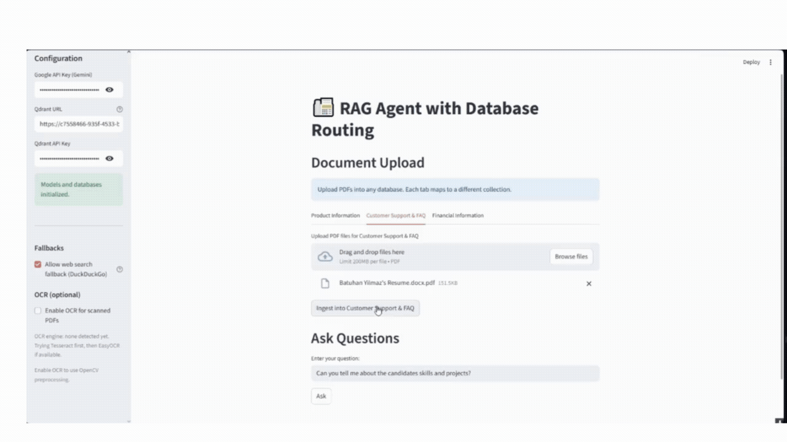

# 📠 RAG Agent with Database Routing

Streamlit app for retrieval-augmented generation (RAG) with multi-database routing, OCR ingestion, and a resilient web fallback.



- Vector store: Qdrant (3 logical DBs: products, support, finance)
- Embeddings/LLM: Gemini (Google Generative AI) with sentence-transformers fallback for embeddings
  - Chat model: gemini-2.5-flash (temperature=0)
  - Embeddings model: gemini-embedding-001
- Routing: Vector-first + LLM fallback routing
- Retrieval: MMR retrievers, adaptive enrichment for list-style queries
- OCR: PyMuPDF rendering + Tesseract/EasyOCR (optional OpenCV preprocessing)
- Web fallback: Direct ddgs (DuckDuckGo) search + concise LLM summarization with sources (no agent)

---

## Features

- Multi-database routing with calibrated thresholds and margin gating
- Dimension-aware Qdrant collections; auto-suffixed when embedding dimension changes
- PDF ingestion with rich metadata (file_name, pdf_title, page_header), plus synthetic FILE_METADATA chunks
- Optional OCR for scanned PDFs; auto-detect Tesseract/EasyOCR; optional OpenCV preproc
- Robust RAG prompts that enumerate all relevant items with short descriptions; adaptive re-ask when needed
- Cross-database aggregation before web fallback
- Web fallback without agents: direct search + LLM summarization (adds Sources)
- Clean separation: `app.py` (UI) vs `rag_core.py` (logic)

---

## Requirements

- Python 3.10+
- Qdrant (Cloud URL + API key or local instance)
- Optional: Google API key for Gemini LLM and embeddings (if missing, embeddings fall back to sentence-transformers and LLM features are disabled)
  - Without a Google API key, the app still routes and retrieves but returns top context snippets instead of generated answers.

---

## Setup (Windows PowerShell)

```powershell
python -m venv venv
./venv/Scripts/Activate.ps1
pip install -r requirements.txt
```

If you use OCR with PyMuPDF/EasyOCR, the first run may download models.

---

## Run

```powershell
streamlit run app.py
```

Open the local URL Streamlit prints.

---

## Configuration (Sidebar)

- Qdrant URL, API Key
- Google API Key (Gemini) — enables LLM and Gemini embeddings
- Web fallback toggle (uses ddgs for web search)
- OCR toggle and OpenCV preprocessing toggle

Routing notes:
- Vector routing prints per-database scores in the UI to aid debugging (only when a question is asked).

Notes:
- Environment variables are optional (you can paste keys into the sidebar). For deployment, prefer env vars.
- Do not commit secrets. A `.gitignore` is included to protect common secret files.

---

## Ingestion Flow

1) Choose a database tab (Products / Support / Finance).
2) Upload PDFs (multiple allowed).
3) Click Ingest. The app:
   - Extracts text and metadata per page
   - Optionally runs OCR (PyMuPDF render → Tesseract or EasyOCR)
   - Adds synthetic FILE_METADATA chunks to help title/name questions
   - Splits into chunks and stores in the chosen Qdrant collection

---

## Query Flow

1) Vector-first routing across collections (normalized scores; avg of top-3; margin gating)
2) If unclear, LLM routing (products/support/finance/none)
3) If no high-confidence target, cross-database retrieval and answer
4) If still no relevant local docs, web fallback (ddgs) with LLM summarization and sources

Behavior details:
- If LLM is disabled, the app shows top context snippets instead of a generated answer.
- Web fallback includes the Sources list inside the answer text (the separate Sources panel is used only for local document chunks).

List-style queries (e.g., “projects”, “skills”) get broader retrieval and an adaptive enrichment pass if the first answer lacks descriptions or items.

---

## Web Fallback

- Uses ddgs (the renamed `duckduckgo_search` package) for direct web search
- Summarizes snippets concisely and appends up to 3 sources
- If LLM is disabled, returns structured raw results (titles/snippets/links)

Notes:
- This implementation does not use an agent; it performs a direct search and then summarizes.
- The “Sources” for web answers are rendered within the answer. The UI’s Sources list is reserved for local document chunks.

Tip: To switch providers (SerpAPI, Tavily, Bing, Google PSE), add a simple `search_web()` adapter and swap it in `handle_web_fallback`.

---

## OCR Details

- PyMuPDF renders each page to an image; we then apply:
  - Tesseract (if available) or EasyOCR fallback
  - Optional OpenCV denoise + adaptive thresholding
- OCR is attempted only if a page has very little extractable text

Windows tips:
- Tesseract OCR is optional; if not installed, the app will try EasyOCR automatically. Installing Tesseract can improve OCR quality/performance.
- A secondary fallback (`pdf2image`) may require Poppler on some systems, but PyMuPDF is used first and typically suffices on Windows.

---

## Environment Variables (optional)

Set these for non-interactive deployments:

- GOOGLE_API_KEY = <your-gemini-key>
- QDRANT_URL = <your-qdrant-url>
- QDRANT_API_KEY = <your-qdrant-key>

You can also supply them via the Streamlit sidebar locally.

---

## Troubleshooting

- ddgs rename warning: This project uses the renamed `ddgs` package. If you see a warning about `duckduckgo_search`, update deps with `pip install -r requirements.txt`.
- LLM disabled: Without `GOOGLE_API_KEY`, you’ll still get embeddings via sentence-transformers, but answers will be raw context snippets.
- Qdrant dim mismatch: The app auto-creates dimension-suffixed collections to avoid errors like “expected dim: 384, got 768”.
- DeprecationWarning on shutdown (swigvarlink): Suppressed in `app.py`; it’s harmless.
 - Web fallback doesn’t show links in the Sources panel: This is expected—the web “Sources” are included in the answer text itself.
 - Tesseract not found: The app falls back to EasyOCR. To use Tesseract, install it system-wide and ensure it’s on PATH; otherwise no action is needed.

---

## Project Structure

```
app.py          # Streamlit UI and orchestration
rag_core.py     # Core: models, ingestion, routing, retrieval, web fallback
requirements.txt
README.md
```